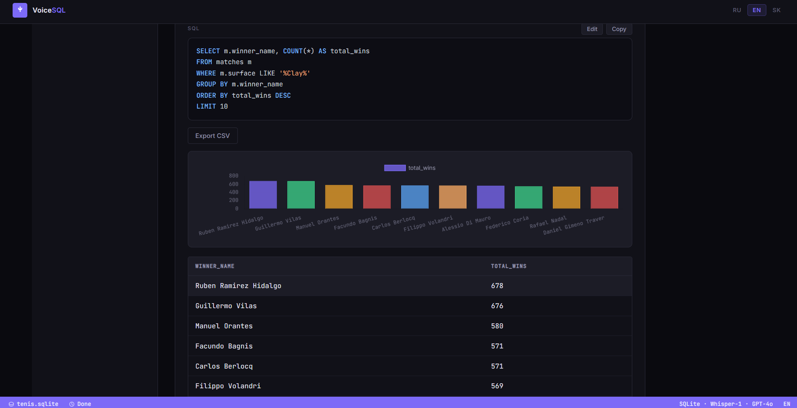
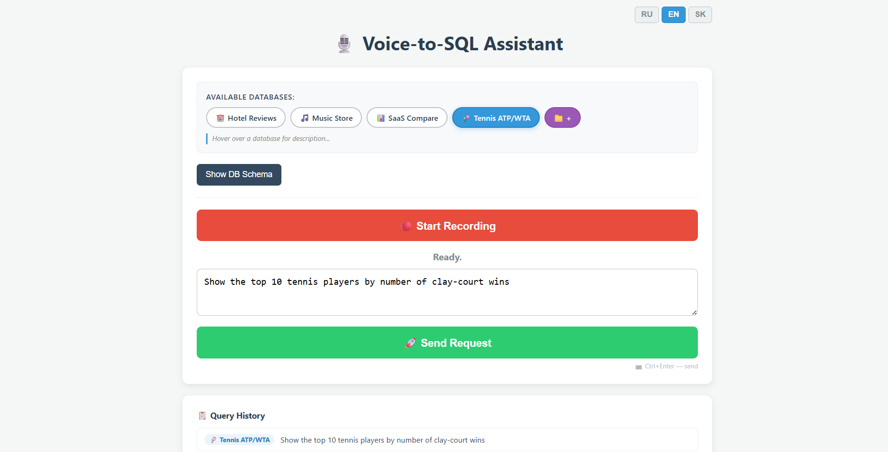

# 🎙️ Voice-to-SQL AI Assistant


An intelligent web-based Data Science and Analytics assistant that empowers users to query SQLite databases using natural voice commands. The application leverages Large Language Models (LLMs) to seamlessly transcribe speech, convert natural language into precise SQL queries, execute them, and visualize the results dynamically.

## ✨ Key Features

* **Voice-Driven Analytics:** Captures audio directly from the browser and transcribes it using OpenAI's Whisper model. Supports English, Russian, and Slovak.
* **Intelligent Text-to-SQL:** Utilizes advanced LLMs to intelligently map natural language onto the uploaded database schema, ensuring accurate SQL generation.
* **Self-Healing SQL Execution:** Features an automated feedback loop. If the generated SQL encounters a database error, the AI analyzes the exception and automatically rewrites the query.
* **Dynamic Data Visualization:** Automatically detects aggregation queries (e.g., `GROUP BY`, `COUNT`) and renders responsive Bar, Pie, or Line charts.



* **Custom Database Uploads:** Upload any `.sqlite` or `.db` file directly through the minimalist UI. The system automatically extracts and registers the database schema.
* **Built-in SQL Editor:** Inspect, edit, and manually execute the generated SQL queries for full transparency and control.
* **Internationalization (i18n):** Fully localized interface powered by `i18next`, dynamically switching between RU, EN, and SK without page reloads.
* **CSV Export:** Download query results instantly for further data analysis.

## 🛠 Comprehensive Tech Stack

**Backend & Architecture**
* **Python 3.9+** — Core backend language.
* **FastAPI** — High-performance, asynchronous web framework.
* **Uvicorn** — Lightning-fast ASGI server.
* **Pydantic** — Strict data validation and settings management using Python type annotations.
* **SQLite3** — Native database engine for executing dynamic queries and extracting schemas.
* **python-multipart** — Handling raw database file uploads.
* **python-dotenv** — Secure environment variable management.

**AI & Machine Learning**
* **OpenAI API** — Core AI integration.
* **Whisper-1** — State-of-the-art automatic speech recognition (ASR) model.
* **GPT-4o / GPT-5** — Advanced reasoning models for natural language understanding and SQL synthesis.

**Frontend & UI/UX**
* **Vanilla JavaScript (ES6+)** — No heavy frontend frameworks, ensuring maximum performance and a lightweight bundle.
* **MediaRecorder API** — Native browser API for capturing raw audio streams.
* **Fetch API** — Modern asynchronous network requests.
* **Chart.js** — HTML5 canvas-based data visualization.
* **i18next & i18next-http-backend** — Industry-standard internationalization library.
* **HTML5 & CSS3** — Clean, responsive, and minimalist UI utilizing modern Flexbox and Grid layouts.

## 🚀 Installation & Setup

1. **Clone the repository:**
```bash
   git clone [https://github.com/your-username/your-repo-name.git](https://github.com/your-username/your-repo-name.git)
   cd your-repo-name
   ```

2. **Create and activate a virtual environment (Recommended):**
```bash
   python -m venv venv
   # On Windows:
   venv\Scripts\activate
   # On macOS/Linux:
   source venv/bin/activate
   ```

3. **Install dependencies:**
```bash
   pip install fastapi uvicorn openai python-dotenv pydantic python-multipart
   ```

4. **Configure environment variables:**
Create a `.env` file in the root directory and add your OpenAI API key:
```env
   OPENAI_API_KEY=sk-your_secret_api_key_here
   ```

5. **Run the application:**
```bash
   uvicorn main:app --reload
   ```

6. **Access the web interface:**
   Open your browser and navigate to [http://127.0.0.1:8000](http://127.0.0.1:8000).

## 🗄️ Download Databases

The sample databases (including the large Tennis ATP/WTA dataset) are available in the Releases section.

📥 **[Download Databases Archive (ZIP)](https://github.com/pavlablo/Voice-to-SQL/releases/download/v1.0/название_твоего_архива.zip)**

**How to use:**
1. Download and extract the `.zip` file.
2. Place the `.sqlite` files inside the `data/` folder in the root of the project.

## 📂 Project Structure

* `data/` — Built-in sample databases (e.g., Music Store, Hotel Reviews).
* `user_data/` — Secure directory for runtime user-uploaded databases.
* `static/` — Frontend assets (`style.css`, `script.js`) and localization files (`locales/`).
* `utils/` — Core utility modules, including schema extraction logic (`db_utils.py`) and engineered LLM prompts (`prompts.py`).
* `tests/` — Standalone test scripts for validating Whisper and LLM API integrations.

## 💡 Usage Examples



To trigger the charting engine, try asking analytical questions:
* *"Show the top 10 tennis players by the number of wins on clay."* (Tennis ATP/WTA Database)
* *"What is the track distribution by genre?"* (Music Store Database)
* *"Compare the average cleanliness rating of hotels across different cities."* (Hotel Reviews Database)
