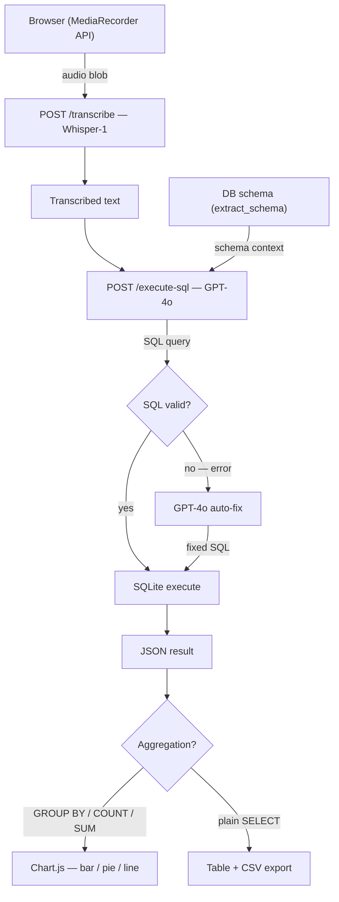

# Voice-controlled database querying

[](https://www.python.org/)
[](https://fastapi.tiangolo.com/)
[](https://www.sqlite.org/)
[](https://platform.openai.com/)
[](https://developer.mozilla.org/en-US/docs/Web/JavaScript)
[](https://www.chartjs.org/)

A web application for querying SQLite databases using natural language voice input. Speech is transcribed via Whisper, converted to SQL by GPT-4o, executed against the selected database, and rendered as a table or chart.


## Features

- **Voice input** — records audio in the browser and transcribes it using OpenAI Whisper. Supports English, Russian, and Slovak.
- **Natural language to SQL** — sends the transcribed text along with the database schema to GPT-4o, which generates the corresponding SQL query.
- **Self-correcting execution** — if the generated SQL fails, the error is sent back to the model which rewrites the query automatically.
- **Dynamic visualization** — queries with aggregations (GROUP BY, COUNT, SUM) are rendered as bar, pie, or line charts via Chart.js.
- **Custom database uploads** — upload any `.sqlite` or `.db` file; the schema is extracted and registered automatically.
- **Built-in SQL editor** — view, edit, and manually run the generated SQL query.
- **Multilingual UI** — interface localized in RU, EN, and SK via i18next, switching without page reload.
- **CSV export** — download query results directly from the UI.


## Architecture



## Tech Stack

**Backend**

- Python 3.9+
- FastAPI + Uvicorn
- Pydantic
- SQLite3
- python-dotenv, python-multipart

**AI**

- OpenAI Whisper-1 — speech-to-text
- GPT-4o — natural language to SQL, error correction, result explanation

**Frontend**

- Vanilla JavaScript (ES6+), HTML5, CSS3
- MediaRecorder API — audio capture
- Chart.js — data visualization
- i18next — localization

## Installation

1. Clone the repository:

```bash
git clone https://github.com/pavlablo/Voice-to-SQL.git
cd Voice-to-SQL
```

2. Create and activate a virtual environment:

```bash
python -m venv venv
# Windows:
venv\Scripts\activate
# macOS/Linux:
source venv/bin/activate
```

3. Install dependencies:

```bash
pip install fastapi uvicorn openai python-dotenv pydantic python-multipart
```

4. Set up environment variables:

```bash
cp .env.example .env
# then open .env and paste your OpenAI API key
```

5. Run the application:

```bash
uvicorn main:app --reload
```

6. Open `http://127.0.0.1:8000` in your browser.

## Sample Databases

The sample databases (Hotel Reviews, Music Store, SaaS Compare, Tennis ATP/WTA) are available in the Releases section.

**[Download databases archive (ZIP)](https://github.com/pavlablo/Voice-to-SQL/releases/download/v1.0/voice-to-sql-databases.zip)**

After downloading, extract the `.sqlite` files into the `data/` folder in the project root.

## Project Structure

```
Voice-to-SQL/
├── data/           # built-in sample databases
├── user_data/      # user-uploaded databases (runtime)
├── static/         # CSS, JS, and localization files (locales/)
├── utils/
│   ├── db_utils.py # schema extraction
│   └── prompts.py  # LLM prompt templates
├── tests/          # API integration test scripts
├── main.py         # FastAPI application
├── index.html
├── .env.example
└── README.md
```

## Example Queries


- "Show the top 10 tennis players by number of wins on clay." — Tennis ATP/WTA database
- "What is the track distribution by genre?" — Music Store database
- "Compare the average cleanliness rating of hotels across different cities." — Hotel Reviews database
